# Assignment 1: Setup & Debugging Journal
**MLOps & ML Programming (2026)**

## Student Information
* **Name:** Nick Wester
* **Student ID:** 15757579
* **TA Name:** S.C.J. Fris BSc
* **GitHub Repository:** https://github.com/nickwesterrr/mlops-assignment-1
* **Base Skeleton Used:** https://github.com/SURF-ML/MLOps_2026/tree/main

---

## Question 1: First Contact with Snellius
1. **Connection Details:**
   - **Command:** `ssh scur2401@snellius.surf.nl`
   - **Login Node:** int5
   - **Screenshot:**

     

2. **Issues Encountered:**
   - **Error Message:** None
   - **Resolution:**

     I did not get any problems during the connection process, because I already had my SSH key configured. When I was configuring the SSH key, I also did not encounter any problems.

3. **Smooth Connection (If applicable):**
   - **SSH Client:** OpenSSH_for_Windows_9.5p2, LibreSSL 3.8.2
   - **Prior Experience:**

     Yes, I did it once more with another project at the university.

   - **Preemptive Steps:**

     I already generated my SSH key before starting with the assignment and I added the key to my SSH keys in the CUA User Portal.

   The output for "ssh -vvv scur2401@snellius.surf.nl" was realy long, so I used a LLM to only show the relevant parts:

   ```text
   OpenSSH_for_Windows_9.5p2, LibreSSL 3.8.2
   debug1: Reading configuration data C:\Users\nick9/.ssh/config
   debug1: Applying options for snellius.surf.nl
   debug2: resolving "snellius.surf.nl" port 22
   debug1: Connecting to snellius.surf.nl [145.136.63.191] port 22.
   debug1: Connection established.

   debug1: identity file C:\Users\nick9/.ssh/id_rsa type 0
   debug1: identity file C:\Users\nick9/.ssh/id_ed25519 type 3

   debug1: Authenticating to snellius.surf.nl:22 as 'scur2401'

   debug3: record_hostkey: found key type ED25519 in file C:\Users\nick9/.ssh/known_hosts
   debug1: Host 'snellius.surf.nl' is known and matches the ED25519 host key.

   debug1: Will attempt key: C:\Users\nick9/.ssh/id_rsa
   debug1: Will attempt key: C:\Users\nick9/.ssh/id_ed25519

   debug1: Offering public key: C:\Users\nick9/.ssh/id_ed25519
   debug1: Server accepts key: C:\Users\nick9/.ssh/id_ed25519
   Authenticated to snellius.surf.nl ([145.136.63.191]:22) using "publickey".

   debug1: Entering interactive session.
   ```

---

## Question 2: Environment Setup
1. **Setup Sequence:**
   - **Commands:**

     I followed along with the syllabus to set up my environment. I decided to use uv as my virtual environment tool. First, the full path to my virtual environment was "/home/scur2401/my_venv". However, later I made a repository folder, added the assignment .md file to it and moved my virtual environment to there and started using VS Code. I also loaded the modules in the new repository and installed torch in there. The new path is "/home/scur2401/mlops-assignment-1/venv".

   - **Full Venv Path:**

     `/home/scur2401/mlops-assignment-1/venv`

   

   

2. **Pip Install Torch:**
   - **Duration:**

     I installed PyTorch using "uv pip install torch" and the first attempt it took approximately 1 minute in total. The second time I installed it in my repository folder, it took approximately 5 seconds.

   - **Warnings:**

     No

   - **Venv Size:**

     The size of my venv folder after installation was 6.5G.

   

   

3. **Mistakes/Unexpected Behavior:**

   I did not encounter any mistakes or unexpected behavior while setting up my environment. However, changing the folder structure and using the VS Code terminal caused some confusion, because I had to load the modules and install torch again in the new folder.

4. **Verification:**
   - **Output:**

     

   - **Explanation:**

     This output is expected because it shows the version of Pytorch that I installed and it also shows that CUDA is not available. This is because I am using a login node that does not have access to a GPU.

---

## Question 3: Version Control Setup
1. **GitHub URL:** https://github.com/nickwesterrr/mlops-assignment-1

2. **Authentication:**

   First, I tried to authenticate using HTTPS with my username and password, but that was not supported by GitHub. So, I created a SSH key and added it to my GitHub account. After this, I could push my code without any problems.

   

3. **.gitignore:**
   - **Contents:**

    I just copied the .gitignore file from the syllabus:

     ```text
     # 1. Ignore Python Cache
     __pycache__/
     *.pyc

     # 2. Ignore Virtual Environments
     venv/
     .env

     # 3. Ignore Data and Models (Too large for Git)
     data/
     experiments/results/
     *.pt
     *.ckpt
     *.h5

     # 4. Ignore Secrets (Security Risk!)
     .env
     keys.json
     wandb/
     ```

   - **Important items to include:**

     Virtual environments, data, models and secrets are important, because they can be really large in size or can contain sensitive information.

   - **README info:**

     For now maybe not, because this is for my own assignment but, otherwise it should not be too specific for my own use case. It should be general enough for other users to understand how load the necessary software, but it should not contain too detailed information about how to accces Snellius.

4. **Git Log:**

   


## Question 4: Your First Batch Job (Slurm)
1. **Files Provided:**
    - "first_job.sh"
    - "hello_world_18154702.out"
2. **Job ID & Stats:**

   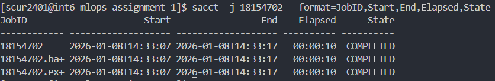

3. **Submission Problem:** 

    First, I loaded de modules from modules.sh, but that importing matplotlib gave an error. I was not even using matplotlob in my script, so I decided to only load the 2025 and python modules. I also forgot to save my .sh file before submitting, so they did not run the first few times.

4. **Verification:**

    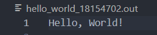

5. **Login vs Batch:**

    The login node is used for interactive tasks, like editing and does not have compute power for heavy tasks. The batch nodes can be used for heavy computations, like training models. They do have acces to more CPU/GPU power and memory.

6. **Why Clusters?:**

    So we can efficiently make use of more compute power than our local machine has and we can also run multiple jobs in parallel on different nodes to make, for example, training faster.
---

## Question 5: Reflection & Conceptual Understanding
1. **The Filesystem:**

    I answered the questions below using the syllabus.

   - **I/O Performance:** 
   
    In GPFS, each small file requires a metadata lookup and distributed locking. So, when there are 100,000 small files, there are a lot of these operations, which slows down the performance significantly.

   - **Mitigation Strategies:**

    To migrate this problem, it is better to use fewer large files instead of many small files. Another strategy is to use the local storage on the compute nodes, because they have a higher IOPS.
    
   - **Dataset Versioning:**

    We can version control datasets via metadata files that contain hashes and versions for each file and we can track these metadata files in Git. This way, we do not have to store the entire dataset in Git, but we can still track changes to it.

2. **Reproducibility:** 

    The results may differ because of different software environments, different hardware and different random shuffles. To prevent these issues, we should use virtual environments, we should document the hardware used and we should fix the random seeds. This way we can make the results reproducible.

3. **Conda vs venv vs uv:**
    - **Conda:**
    
     The pro of Conda is that it is not only used for Python packages, but also non-python software. However, creating environments with Conda can be slow because it creates a lot of very small files, which is not ideal for GPFS filesystems. It is also platform- and solver-dependent, which makes it less scalable. Conda also has poor integration with environment modules and does not use the optimal CUDA installation on Snellius.
    
    - **venv:**
    
     Python venv is build-in and requires no additional installation. It also avoids dependency conflicts and allows us to install packages locally, since we do not have root acces. It is also realy good for reproducibility, using requirements.txt files. The cons are that is only works with Python packages and it is slower than uv.
    
    - **uv:**
    
     Astral uv is significantly faster than venv and conda, due to more efficient file operations. It also has fewer file operations, which is better for Snellius' filesystem. It replaces both venv and pip, so we do not have to use multiple tools. The only con is that it is new and not as widely used as venv and conda. It is also only focused on Python packages.

---

## Question 6: Package Integrity
1. **ModuleNotFoundError:**

    I did not get any issues, because I already installed the depencies using "uv pip install -e ."

2. **Import Abstraction:**

    ml_core.data is more general and can be used for multiple datasets, while importing ml_core.data.pcam is specific to the PCAM dataset.

3. **Pytest Result:**

    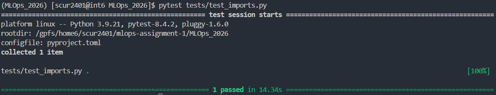

    I see that the test passed successfully.

---

## Question 7: The Data Pipeline
1. **Implementation:**

   ```python
   def __getitem__(self, idx: int) -> Tuple[torch.Tensor, torch.Tensor]:
   # TODO: Implement data retrieval
   # 1. Read data at idx
   # 2. Convert to uint8 (for PIL compatibility if using transforms)
   # 3. Apply transforms if they exist
   # 4. Return tensor image and label (as long)
        
   # Read specific index
   real_idx = self.indices[idx]
   image = self.x_data[real_idx]
   label = self.y_data[real_idx][0]

   # Ensure uint8 for PIL compatibility
   image = image.astype(np.uint8)

   if self.transform:
      image = self.transform(image)
   
   # CrossEntropyLoss requires Long (int64)
   return image, torch.tensor(label, dtype=torch.long).squeeze()
   ```
   The PCAM dataset is accessed using h5py and lazily loaded. Samples are accessed trhough an index list "self.indices" to allow filtering. The image data is converted to uint8 for compatibility with PIL.

2. **Local Pytest:**

   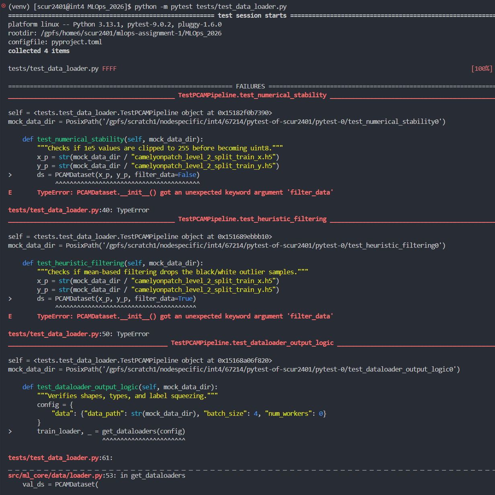
   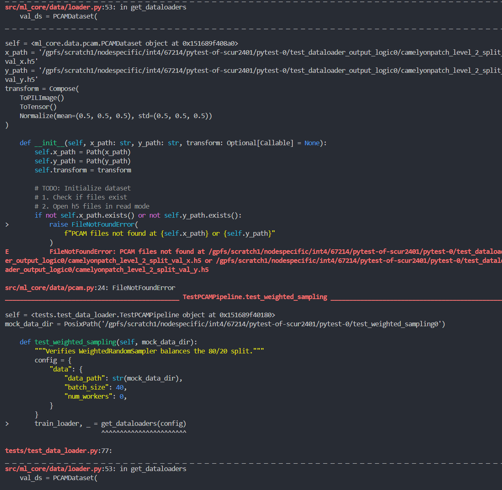
   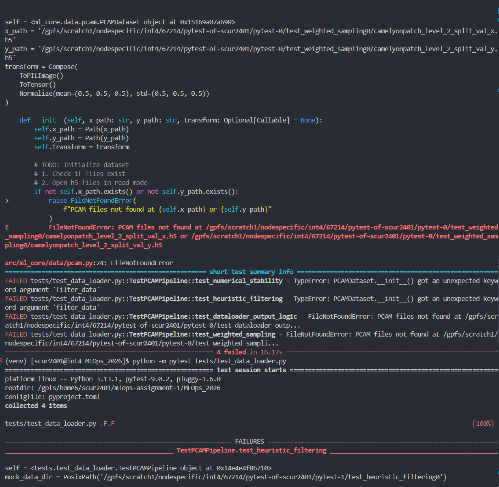
   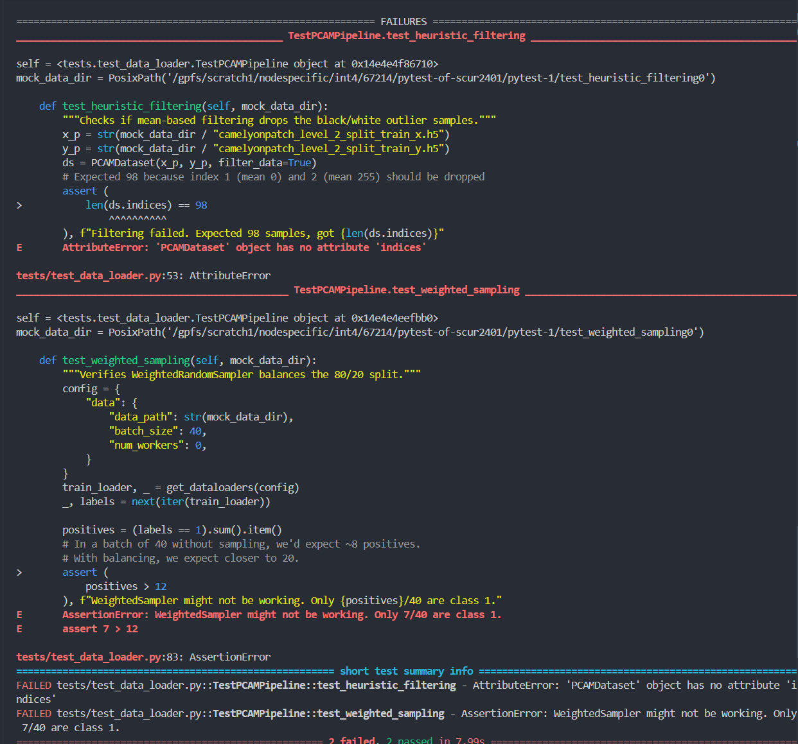
   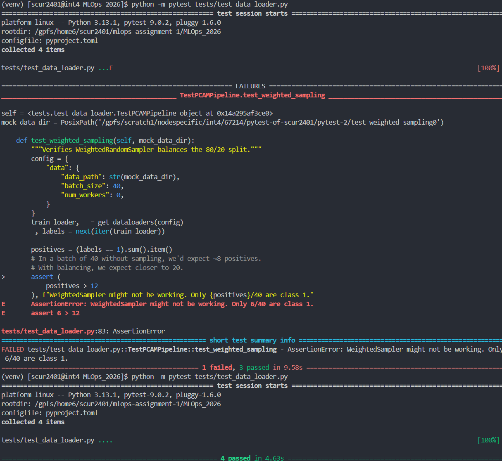

   After a few attempts, I passed all the tests. First, I had to add a "filter_data" parameter to the PCAMDataset and added a "self.indices" list to be able to filter the data. I also did not use the correct filenames for the validation sets, so I changed those. Finally, I still had to remove shuffling and changed it to use the sampler in the DataLoader.
   
3. **CI Pipeline:**
   - **Screenshot:**

   When I ran the CI Pipeline, both "Lint Check" and "Run Tests" failed. I tried to fix the erros with automatic Ruff fixes, but some errors remained. These errors occur in files that I haven't modified yet, so I will fix them later when I work on those files.

   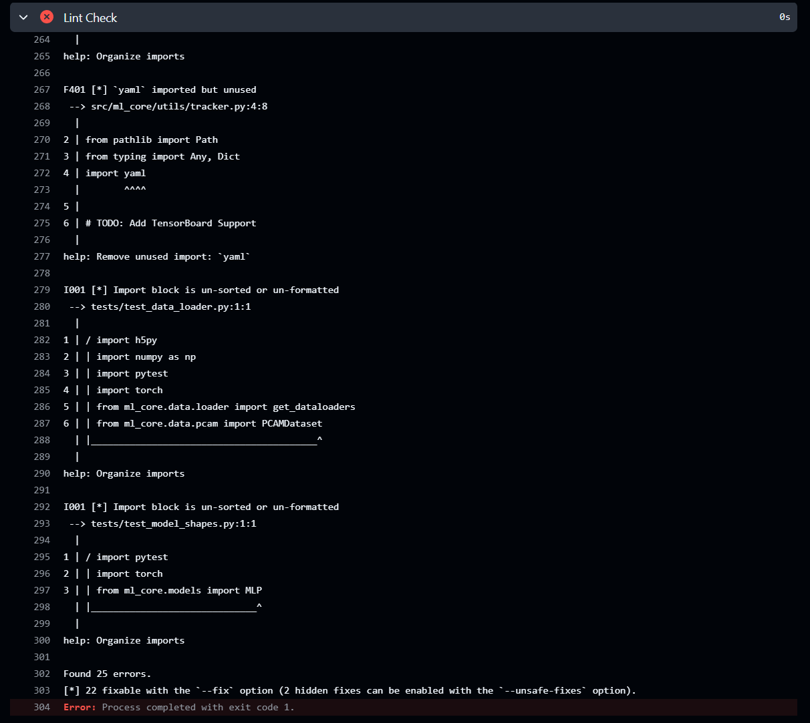
   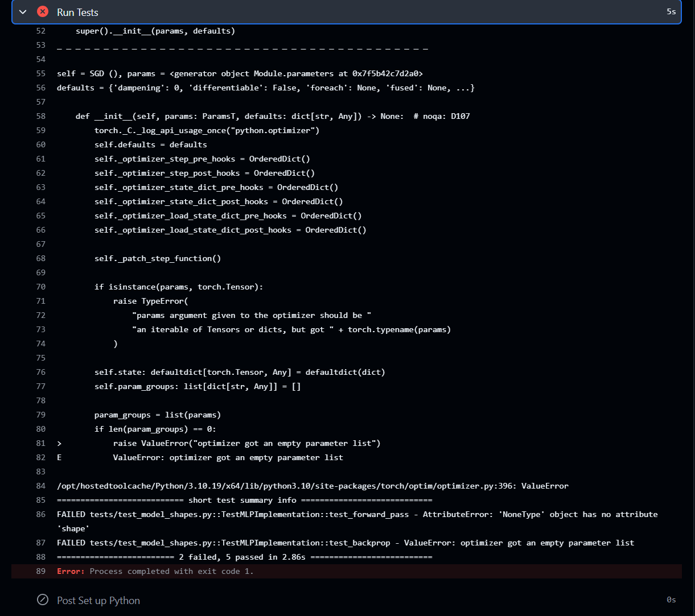

   After "ruff --fix":

   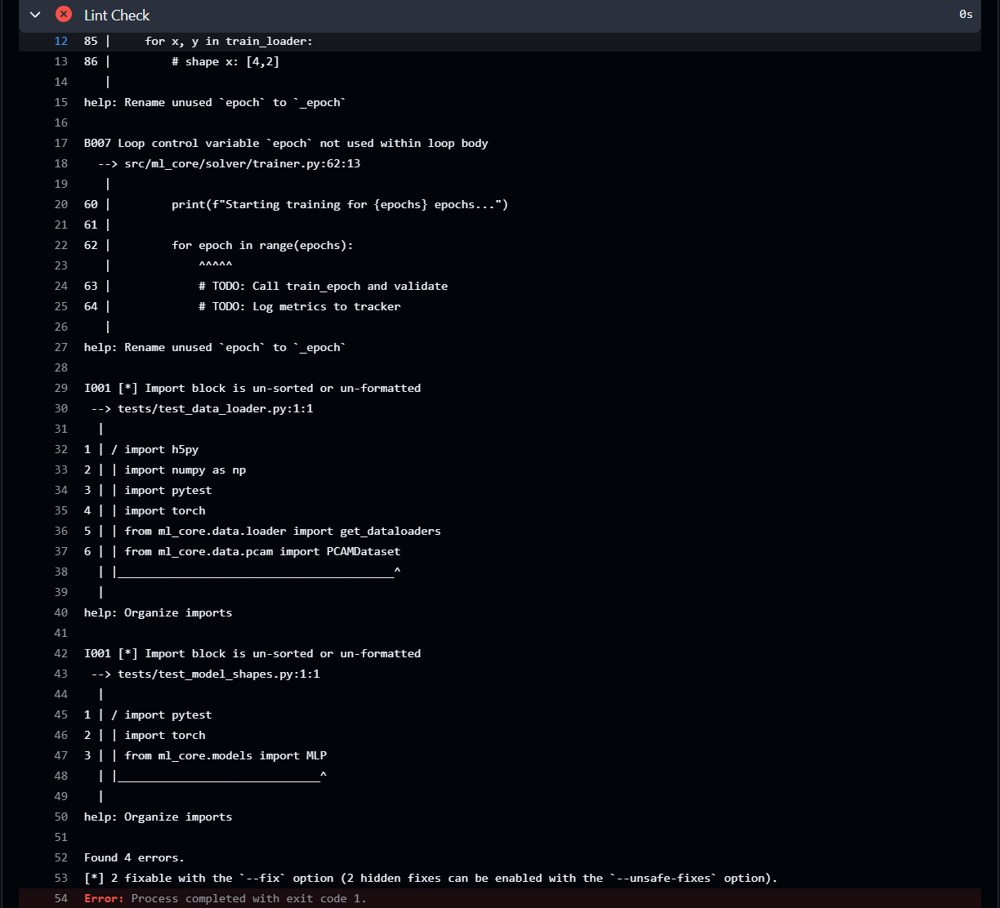
   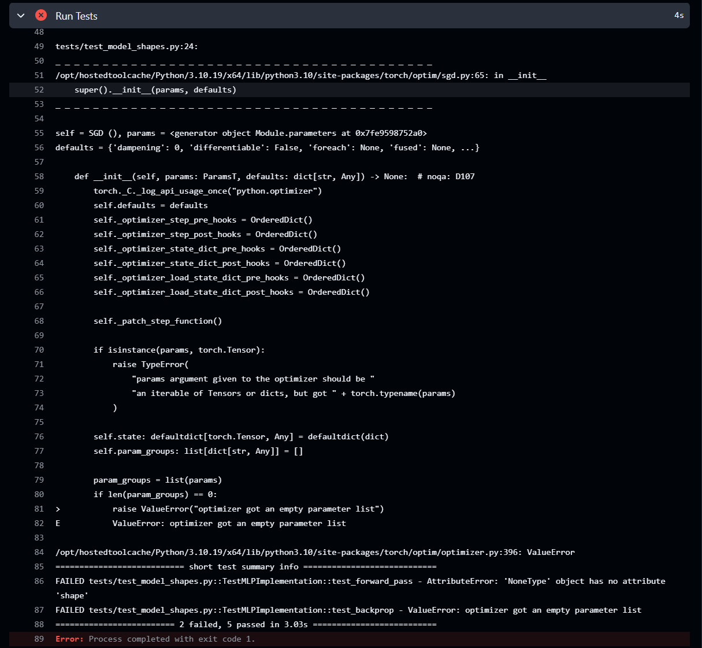

   - **Reflection:**

   This might happen in a real-world MLOps setting, because the CI pipeline is stricter and checks for linting and test errors on every commit. If there are errors in any part of the codebase, the pipeline will fail, even if the changes made in the commit are correct. 

4. **Sampling Math:**

   Just by looking at my loader file, I don't know the exact number of positive samples without the WeightedRandomSampler. With the sampler, I can expect to have an equal number of positive and negative samples in each epoch, so 16 positive samples with a batch size of 32.

5. **EDA Plots:**
   - 
   - [Additional plots as requested]

---

## Question 8: Model Implementation (MLP)
1. **Forward Pass:** [Error details + dimension calculation for (3, 96, 96)]
2. **Weight Updates:** [Why check backprop explicitly?]
3. **Test Output:** `[Paste output of pytest on the relevant file]`

---

## Question 9: Training Loop & Loss Visualization
1. **Training Execution:** [Method used + Node ID (gcnXX)]
2. **Loss Visualization:**
   - **Plot:** 
   - **Trajectory Analysis:** [Healthy curve? Trajectory hypothesis?]
3. **Most Frustrating Error:**
   - **Error Message:** `[Traceback]`
   - **Debugging Steps:** [How you resolved it]

---

## Final Submission Checklist
- [ ] Folder contains .md file and assets/ folder?
- [ ] Name and Student ID on page 1?
- [ ] All code/terminal snippets are in backtick blocks?
- [ ] All images use relative paths (e.g., assets/pcam.png)?
- [ ] Slurm .sh and .out files included in the .zip?