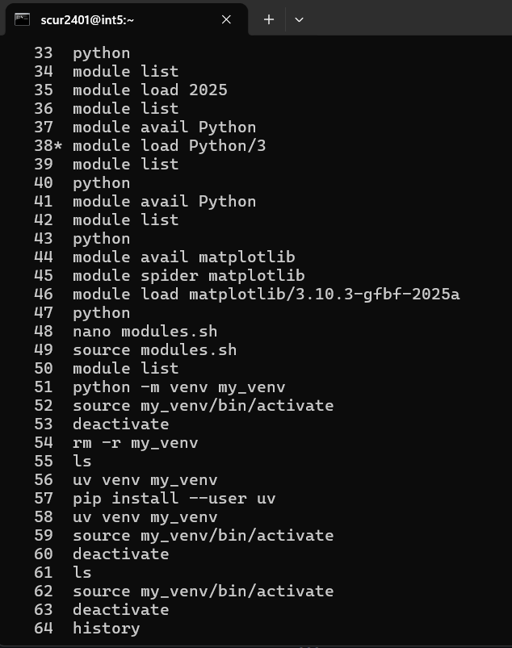
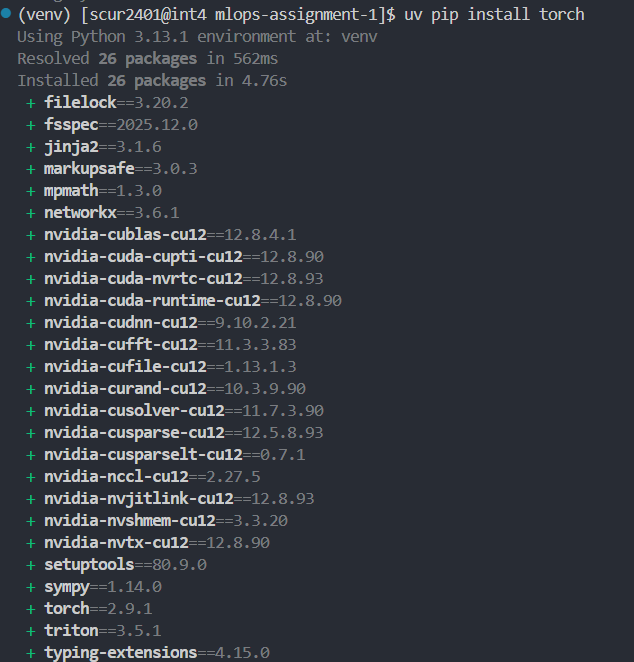
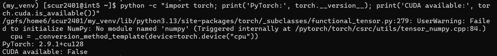
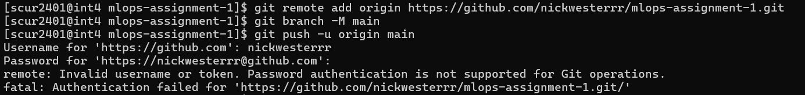
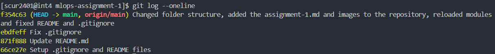

# Assignment 1: Setup & Debugging Journal
**MLOps & ML Programming (2026)**

## Student Information
* **Name:** Nick Wester
* **Student ID:** 15757579
* **TA Name:** S.C.J. Fris BSc
* **GitHub Repository:** https://github.com/nickwesterrr/mlops-assignment-1
* **Base Skeleton Used:** https://github.com/SURF-ML/MLOps_2026/tree/main

---

## Question 1: First Contact with Snellius
1. **Connection Details:**
   - **Command:** `ssh scur2401@snellius.surf.nl`
   - **Login Node:** int5
   - **Screenshot:**

     

2. **Issues Encountered:**
   - **Error Message:** None
   - **Resolution:**

     I did not get any problems during the connection process, because I already had my SSH key configured. When I was configuring the SSH key, I also did not encounter any problems.

3. **Smooth Connection (If applicable):**
   - **SSH Client:** OpenSSH_for_Windows_9.5p2, LibreSSL 3.8.2
   - **Prior Experience:**

     Yes, I did it once more with another project at the university.

   - **Preemptive Steps:**

     I already generated my SSH key before starting with the assignment and I added the key to my SSH keys in the CUA User Portal.

   The output for "ssh -vvv scur2401@snellius.surf.nl" was realy long, so I used a LLM to only show the relevant parts:

   ```text
   OpenSSH_for_Windows_9.5p2, LibreSSL 3.8.2
   debug1: Reading configuration data C:\Users\nick9/.ssh/config
   debug1: Applying options for snellius.surf.nl
   debug2: resolving "snellius.surf.nl" port 22
   debug1: Connecting to snellius.surf.nl [145.136.63.191] port 22.
   debug1: Connection established.

   debug1: identity file C:\Users\nick9/.ssh/id_rsa type 0
   debug1: identity file C:\Users\nick9/.ssh/id_ed25519 type 3

   debug1: Authenticating to snellius.surf.nl:22 as 'scur2401'

   debug3: record_hostkey: found key type ED25519 in file C:\Users\nick9/.ssh/known_hosts
   debug1: Host 'snellius.surf.nl' is known and matches the ED25519 host key.

   debug1: Will attempt key: C:\Users\nick9/.ssh/id_rsa
   debug1: Will attempt key: C:\Users\nick9/.ssh/id_ed25519

   debug1: Offering public key: C:\Users\nick9/.ssh/id_ed25519
   debug1: Server accepts key: C:\Users\nick9/.ssh/id_ed25519
   Authenticated to snellius.surf.nl ([145.136.63.191]:22) using "publickey".

   debug1: Entering interactive session.
   ```

---

## Question 2: Environment Setup
1. **Setup Sequence:**
   - **Commands:**

     I followed along with the syllabus to set up my environment. I decided to use uv as my virtual environment tool. First, the full path to my virtual environment was "/home/scur2401/my_venv". However, later I made a repository folder, added the assignment .md file to it and moved my virtual environment to there and started using VS Code. I also loaded the modules in the new repository and installed torch in there. The new path is "/home/scur2401/mlops-assignment-1/venv".

   - **Full Venv Path:**

     `/home/scur2401/mlops-assignment-1/venv`

   

   

2. **Pip Install Torch:**
   - **Duration:**

     I installed PyTorch using "uv pip install torch" and the first attempt it took approximately 1 minute in total. The second time I installed it in my repository folder, it took approximately 5 seconds.

   - **Warnings:**

     No

   - **Venv Size:**

     The size of my venv folder after installation was 6.5G.

   

   

3. **Mistakes/Unexpected Behavior:**

   I did not encounter any mistakes or unexpected behavior while setting up my environment. However, changing the folder structure and using the VS Code terminal caused some confusion, because I had to load the modules and install torch again in the new folder.

4. **Verification:**
   - **Output:**

     

   - **Explanation:**

     This output is expected because it shows the version of Pytorch that I installed and it also shows that CUDA is not available. This is because I am using a login node that does not have access to a GPU.

---

## Question 3: Version Control Setup
1. **GitHub URL:** https://github.com/nickwesterrr/mlops-assignment-1

2. **Authentication:**

   First, I tried to authenticate using HTTPS with my username and password, but that was not supported by GitHub. So, I created a SSH key and added it to my GitHub account. After this, I could push my code without any problems.

   

3. **.gitignore:**
   - **Contents:**

    I just copied the .gitignore file from the syllabus:

     ```text
     # 1. Ignore Python Cache
     __pycache__/
     *.pyc

     # 2. Ignore Virtual Environments
     venv/
     .env

     # 3. Ignore Data and Models (Too large for Git)
     data/
     experiments/results/
     *.pt
     *.ckpt
     *.h5

     # 4. Ignore Secrets (Security Risk!)
     .env
     keys.json
     wandb/
     ```

   - **Important items to include:**

     Virtual environments, data, models and secrets are important, because they can be really large in size or can contain sensitive information.

   - **README info:**

     For now maybe not, because this is for my own assignment but, otherwise it should not be too specific for my own use case. It should be general enough for other users to understand how load the necessary software, but it should not contain too detailed information about how to accces Snellius.

4. **Git Log:**

   


## Question 4: Your First Batch Job (Slurm)
1. **Files Provided:** [List your .sh, .py, and output.txt files included in zip]
2. **Job ID & Stats:** `[Paste output of sacct command]`
3. **Submission Problem:** [Describe error and diagnosis]
4. **Verification:** [Proof that script ran successfully]
5. **Login vs Batch:** [Explain the difference]
6. **Why Clusters?:** 
---

## Question 5: Reflection & Conceptual Understanding
1. **The Filesystem:**
   - **I/O Performance:** [Why 100k small files are bad]
   - **Mitigation Strategies:** [Strategy 1] and [Strategy 2]
   - **Dataset Versioning:** [How to handle GB/PB datasets]
2. **Reproducibility:** [3 specific causes of different results + MLOps fixes]
3. **Conda vs venv vs uv:** [Pros/Cons of each for Snellius]

---

## Question 6: Package Integrity
1. **ModuleNotFoundError:** [Describe any PYTHONPATH or __init__.py issues]
2. **Import Abstraction:** [Why import from ml_core.data vs ml_core.data.pcam?]
3. **Pytest Result:** `[Paste output of pytest tests/test_imports.py]`

---

## Question 7: The Data Pipeline
1. **Implementation:** `[Paste __getitem__ method]`
2. **Local Pytest:** `[Paste output of pytest tests/test_pcam_pipeline.py]`
3. **CI Pipeline:**
   - **Screenshot:** 
   - **Reflection:** [CI vs Local discrepancies]
4. **Sampling Math:** [Average positives with vs without WeightedRandomSampler]
5. **EDA Plots:**
   - 
   - [Additional plots as requested]

---

## Question 8: Model Implementation (MLP)
1. **Forward Pass:** [Error details + dimension calculation for (3, 96, 96)]
2. **Weight Updates:** [Why check backprop explicitly?]
3. **Test Output:** `[Paste output of pytest on the relevant file]`

---

## Question 9: Training Loop & Loss Visualization
1. **Training Execution:** [Method used + Node ID (gcnXX)]
2. **Loss Visualization:**
   - **Plot:** 
   - **Trajectory Analysis:** [Healthy curve? Trajectory hypothesis?]
3. **Most Frustrating Error:**
   - **Error Message:** `[Traceback]`
   - **Debugging Steps:** [How you resolved it]

---

## Final Submission Checklist
- [ ] Folder contains .md file and assets/ folder?
- [ ] Name and Student ID on page 1?
- [ ] All code/terminal snippets are in backtick blocks?
- [ ] All images use relative paths (e.g., assets/pcam.png)?
- [ ] Slurm .sh and .out files included in the .zip?